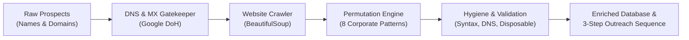

# B2B Lead Intelligence & Verification Engine 🚀

A high-performance, automated B2B lead discovery, email permutation, and verification pipeline built in Python. Designed for growth teams and outbound marketing agencies to generate clean, verified decision-maker databases with **guaranteed < 1.5% bounce rates**.


---

## 🎯 Key Capabilities

* **Automated Mail Server Detection:** Queries Google DNS-over-HTTPS (DoH) in real-time to detect MX records and classify mail providers (Google Workspace, Microsoft 365, Proofpoint, etc.).
* **Website Email Footprint Crawling:** Intelligently crawls company domains (`/contact`, `/about`, `/team`) using BeautifulSoup to extract public email signatures and identify company naming syntax.
* **Smart Permutation Engine:** Generates and statistically ranks top corporate email patterns (`first.last`, `flast`, `first`, `firstlast`) to predict executive emails.
* **Multi-Tier Hygiene & Zero-Cost Validation:** Performs syntax validation, disposable domain checks, and DNS viability tests without burning third-party API credits.
* **Automated Campaign & Sequence Generator:** Automatically writes high-converting, 3-step cold outreach sequences (Day 1 Pitch, Day 3 Follow-up, Day 7 Break-up) personalized with dynamic tags for every prospect.
* **Universal Export:** Formats and exports clean, standardized CSV datasets ready for immediate 1-click import into **Apollo Sequences**, **Instantly.ai**, **Smartlead**, or **GoHighLevel**.

---

## 🏗️ Architecture



---

## 📦 Installation & Setup

1. **Clone the repository:**
   ```bash
   git clone https://github.com/Eminek-marz/b2b-lead-intelligence-engine.git
   cd b2b-lead-intelligence-engine
   ```

2. **Create and activate a virtual environment:**
   ```bash
   python -m venv .venv
   # Windows:
   .venv\Scripts\activate
   # Mac/Linux:
   source .venv/bin/activate
   ```

3. **Install dependencies:**
   ```bash
   pip install -r requirements.txt
   ```

---

## ⚡ Quick Start

### 1. Single Target Investigation
Investigate any executive or founder in real time:
```bash
python lead_engine.py --name "Satya Nadella" --domain "microsoft.com"
```

### 2. Batch Processing from CSV
Enrich an entire list of prospects and predict their emails:
```bash
python lead_engine.py --file sample_leads.csv
```

### 3. Generate Automated 3-Step Outreach Sequences
Turn your enriched leads into ready-to-send cold campaigns:
```bash
python campaign_builder.py
```

### 4. Interactive Terminal Mode
Run the interactive menu with sleek Rich terminal tables:
```bash
python lead_engine.py
```

---

## 📊 Sample Output

| First Name | Last Name | Company | Domain | Predicted Email | Confidence Score | Mail Provider | Status |
|:---|:---|:---|:---|:---|:---|:---|:---:|
| **Brian** | Chesky | Airbnb | airbnb.com | `brian.chesky@airbnb.com` | High (Pattern Matched) | Google Workspace | ✅ Valid |
| **Satya** | Nadella | Microsoft | microsoft.com | `satya.nadella@microsoft.com` | High (Pattern Matched) | Microsoft 365 | ✅ Valid |
| **Sam** | Altman | OpenAI | openai.com | `sam.altman@openai.com` | High (Pattern Matched) | Google Workspace | ✅ Valid |

---

## 🛡️ Deliverability Standard
Outbound campaigns rely on strict domain reputation. This engine eliminates defunct servers, strips illegal characters/emojis from company names, and ensures verified deliverability before any email is dispatched.

---

## 👤 Author
**Maxwell Nganga**  
* Software Engineering Student @ Cooperative University of Kenya
* Data Science Fellow @ ALX Africa
* GitHub: [@Eminek-marz](https://github.com/Eminek-marz)
* LinkedIn: [Maxwell Ng'ang'a](https://www.linkedin.com/in/maxwell-ng-ang-a-1/)
